# Procesverslag
Markdown is een simpele manier om HTML te schrijven.  
Markdown cheat cheet: [Hulp bij het schrijven van Markdown](https://github.com/adam-p/markdown-here/wiki/Markdown-Cheatsheet).

Nb. De standaardstructuur en de spartaanse opmaak van de README.md zijn helemaal prima. Het gaat om de inhoud van je procesverslag. Besteedt de tijd voor pracht en praal aan je website.

Nb. Door *open* toe te voegen aan een *details* element kun je deze standaard open zetten. Fijn om dat steeds voor de relevante stuk(ken) te doen.

## Jij

  
uitwerken voor kick-off werkgroep

  ### Auteur:
  Isabelle Eldering.

  #### Je startniveau:
  Blauwe Piste

  #### Je focus:
  Surface plane (Bling Bling)
 

## Je website

  
uitwerken voor kick-off werkgroep

  ### Je opdracht:
  link naar de website die je gaat namaken óf de naam/omschrijving van je eigen ontwerp

  #### Screenshot(s) van de eerste pagina (small screen): 
  hier de naam van de pagina  
  

  #### Screenshot(s) van de tweede pagina (small screen):
  hier de naam van de pagina  
  
 

## Toegankelijkheidstest 1/2 (week 1)

  
uitwerken na test in 1e werkgroep

  ### Bevindingen
  Lijst met je bevindingen die in de test naar voren kwamen:

  #### Screenreader
  Hier korte omschrijving:
  Het was erg ingewikkeld om voor elkaar te krijgen. Ik snapte niet goed hoe het nou moest werken.

  Hier een omschrijving van hoe het opgelost kan worden (met indien nodig afbeeldingen)

  #### Muis en Toetsenbord 
  Hier korte omschrijving: 
    Keyboard only:
    Het was heel erg omslachtig om de hele tijd op TAB te blijven drukken totdat je uiteindelijk bij het linkje was waar je wilde zijn.
    Baloon hoog houden:
    Het is niet heel erg vervelend. het is lastig met een lange tekst lezen want dan moet je natuurlijk geconcentreed zijn of bij het indrukken van je trackpad op je mac. daar is het lastige

  Hier een omschrijving van hoe het opgelost kan worden:
  Voor Keyboard only zou je bijvoorbeeld snel menus kunnen maken zodat je het blijven tabben door alle linkjes in de menus skippen
  Voor concentratie problemen zou je kunnen denken aan niet al te lange teksten en duidelijke buttons.

  #### Motoriek (shocks, elastiekjes)
  Hier korte omschrijving:
  Elastiekjes:
    Dat is op je computer redelijk te doen. Je kan bijna alles gewoon doen. Bij je telefoon wordt het lastiger. Je gebruikt toch veel je telefoon met je duim. als je dan je duim niet hebt maakt dat het heel lastig en moet je eerder de telefoon neerleggen of in je andere hadn houden.

    Shocks:
    Het was erg lastig om de controle over je arm en hand te houden.

  Hier een omschrijving van hoe het opgelost kan worden:
  Grotere knoppen en meer ruimte tussen de knoppen.

  #### Visueel (brillen, contrast, kleurenblind, dark/light). 
  Hier korte omschrijving:
    - De bril met een zwarte stip:
    Is erg hinderlijk. Je kan eigenlijk niks meer zien. Ik als niet blinden kan dan nog cheaten door rond om die stip te kijken en dan kan je nog genoeg zien, maar voor iemand die het wel heeft kan je daar niet om heen en overal waar je heen kijkt kan zie je de stip.

  Hier een omschrijving van hoe het opgelost kan worden:
  Grote muis en grote letters

## Breakdownschets (week 1)

  
uitwerken na afloop 2e werkgroep

  ### de hele pagina: 
  

  ### dynamisch deel (bijv menu): 
  

  ### wellicht nog een dynamisch deel (bijv filter): 
  

## Voortgang 1 (week 2)

  
uitwerken voor 1e voortgang

  ### Stand van zaken
  Ik vond het heel lastig om op gang te komen. Ik wist niet goed hoe ik moest beginnen.

  Ik wilde het eerst op deze manier gaan vormgeven:
  
  
  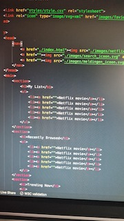
  
  
  
  En dat zag er dan zo uit zonder CSS:
  
  
  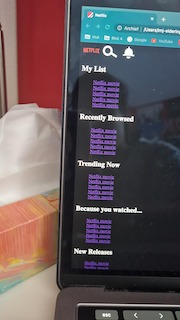

  Maar ik kwam niet verder op deze manier, omdat ik niet goed wist hoe ik dat dan moest gaan vormgeven dat het er op dezelfde manier uit komt te zien als bij Netflix.

  Dus heb ik hulp gevraagd bij 1 van mijn klasgenoten.
  Hij zei dat ik het beste van die <a> een  kan maken en dan gewoon de afbeeldingen van Netflix zelf gebruiken.
  
  
  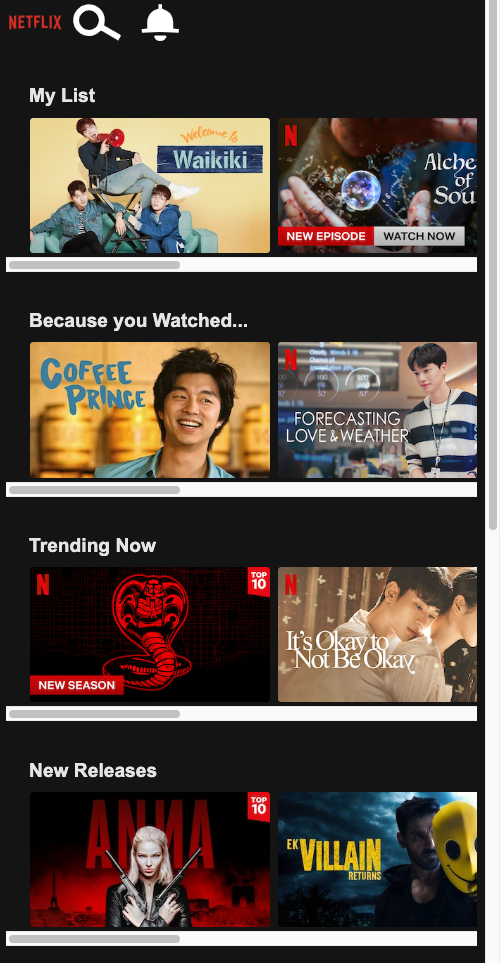

  
  
  
  Ik denk dat ik al goed opweg ben.

  ### Agenda voor meeting
  samen met je groepje opstellen

  | Isabelle       | student 2          | student 3    | student 4        |
  | ---            | ---                | ---          | ---              |
  | Semantiek van mn code  | en dit             | en ik dit    | en dan ik dat    |
  | Vragen stellen | dit als er tijd is | nog een punt | dit wil ik zeker |
  | horizontale scrollbalken weg         | ...                | ...          | ...              |

  ### Verslag van meeting
  hier na afloop snel de uitkomsten van de meeting vastleggen

  - Uitvogelen hoe selectoren werken
  - Verder niks

## Voortgang 2 (week 3)

  
uitwerken voor 2e voortgang

  ### Stand van zaken
  Ik had deze week een aantal vragen aan de student assistent. Hij heeft mij geholpen om dit input field bij het vergrootglas te maken.

  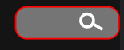

  Om dat samen met mij te doen en uit te leggen heeft dat veel tijd gekost en heb ik dus verder geen dingen meer kunnen vragen, maar dat was ook niet nodig

  ### Agenda voor meeting
  samen met je groepje opstellen

  | Isabelle     | student 2          | student 3    | student 4        |
  | ---            | ---                | ---          | ---              |
  | vragen stellen | dit als er tijd is | nog een punt | dit wil ik zeker |
  | ...            | ...                | ...          | ...              |

  ### Verslag van meeting
  hier na afloop snel de uitkomsten van de meeting vastleggen

  - Vragen stellen

## Toegankelijkheidstest 2/2 (week 4)

  
uitwerken na test in 8e werkgroep

  ### Bevindingen
  Lijst met je bevindingen die in de test naar voren kwamen (geef ook aan wat er verbeterd is):

  Ik merkte dat het erg last was om iets te kunnen verbeteren aan de toegankelijkheid van Netflix. Als zag er naar uit dat er goed over na is gedacht over alles zodat iedereen het goed kan gebruiken.

  Het enige wat ik ben tegen gekomen wat beter had gekunt, is de duidelijkheid van de Focus state tijdens het tabben.

  #### Screenreader
  Hier korte omschrijving (met indien nodig afbeeldingen)

  Bij het testen van de screen reader ging alles goed. Alles werd goed voor gelezen en er kwamen geen rare teksten.

  Hier een omschrijving van hoe het opgelost kan worden (met indien nodig afbeeldingen)

  Goed alt gebruiken

  #### Muis en Toetsenbord 
  Hier korte omschrijving (met indien nodig afbeeldingen)

  hier was ook geen probleem te vinden

  Hier een omschrijving van hoe het opgelost kan worden (met indien nodig afbeeldingen)

  #### Motoriek (shocks, elastiekjes)
  Hier korte omschrijving (met indien nodig afbeeldingen)

  Hier was ook geen probleem te vinden.

  Ik maak gebruik van goede grote buttons zodat ze niet moeilijk te miss zijn

  Hier een omschrijving van hoe het opgelost kan worden (met indien nodig afbeeldingen)

  #### Visueel (brillen, contrast, kleurenblind, dark/light). 
  Hier korte omschrijving (met indien nodig afbeeldingen)

  Tijdens het proberen van de brillen kwam ik er achter dat dat opzich ook werkt. Sommige bijna niet maar dat komt omdat die beperking hee vervelend is.

  dat geld dan voor de bril waar je alleen maar door een klein puntje kan kijken.

  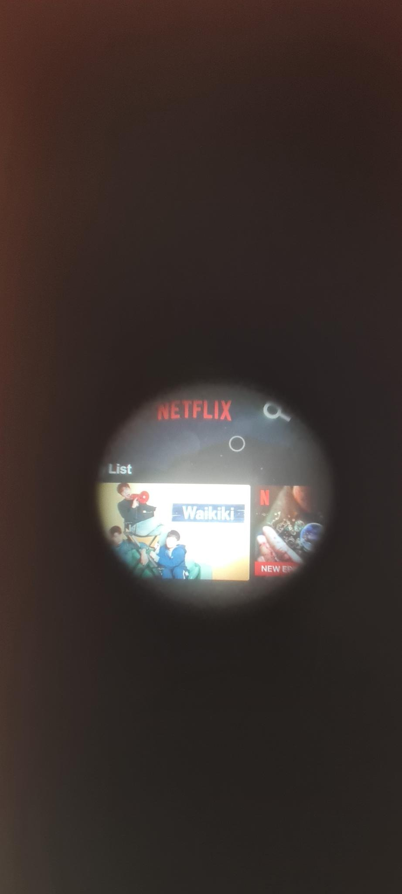

  
  Bij het testen van contrast, kleurenblind en dark/light mode ben ik er achter gekomen, dat mijn site nog goed te volgen is. Maar bij een paar ook zeker niet.

  Hier een paar voorbeelden waar het wel goed ging:

  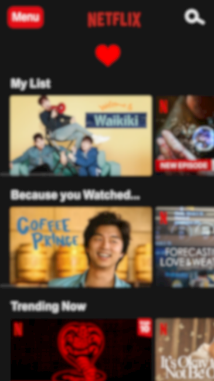

  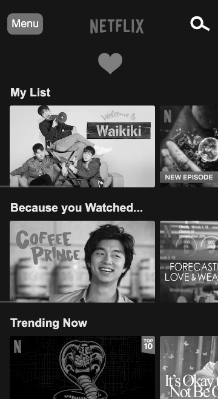

  Bij mijn Valentijn pagina ben ik er achter gekomen dat er bij een paar beperkingen het contrast niet goed is. De witte tekst is dan niet goed te zien op de licht roze achtergrond.

  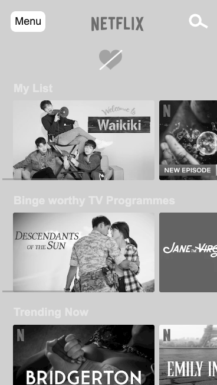

  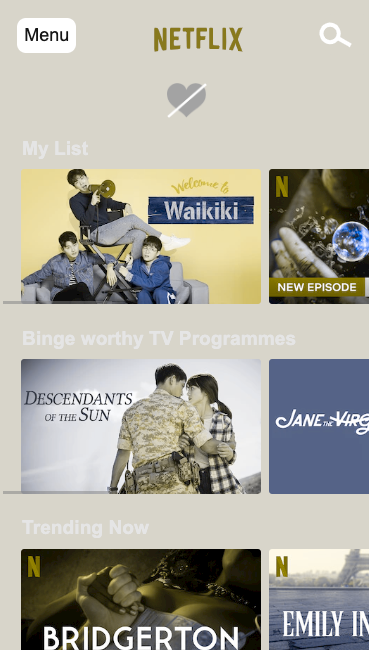

  Hier een omschrijving van hoe het opgelost kan worden (met indien nodig afbeeldingen)

  Ik heb het probleem van de Valentijn pagina opgelost door de tekst zwart te maken voor een beter contrast.

  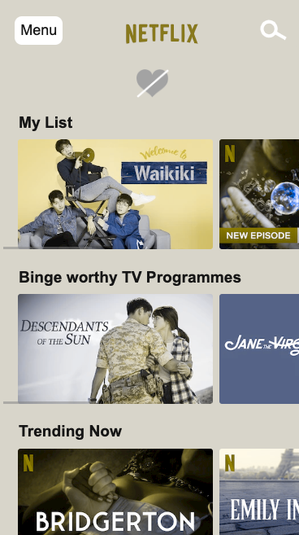

  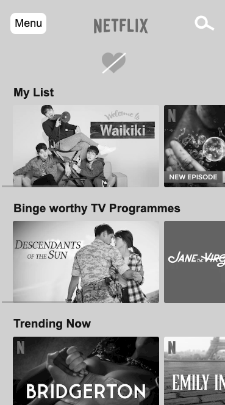

## Voortgang 3 (week 4)

  
uitwerken voor 3e voortgang

  ### Stand van zaken
  hier dit ging goed & dit was lastig (neem ook screenshots op van delen van je website en code)
  Ik heb tijdens dit gesprek vooral veel vragen gesteld over hoe ik dingen beter kon maken. 

  ### Agenda voor meeting
  samen met je groepje opstellen

  | student 1      | student 2          | student 3    | student 4        |
  | ---            | ---                | ---          | ---              |
  | vragen stellen | dit als er tijd is | nog een punt | dit wil ik zeker |
  | ...            | ...                | ...          | ...              |

  ### Verslag van meeting
  hier na afloop snel de uitkomsten van de meeting vastleggen

  - semantiek van detail HTML pagina
  - Detail pagina episodes stukje of dat goed genoeg is 

## Eindgesprek (week 5)

  
uitwerken voor eindgesprek

  ### Je uitkomst - karakteristiek screenshots:
  

  ### Dit ging goed/Heb ik geleerd: 
  Korte omschrijving met plaatjes

  

  ### Dit was lastig/Is niet gelukt:
  Korte omschrijving met plaatjes

  

## Bronnenlijst

  
continu bijhouden terwijl je werkt

  Nb. Wees specifiek ('css-tricks' als bron is bijv. niet specifiek genoeg).

  1. Voor alle plaatjes + Netflix logo + alle teksten op de index:
  https://www.netflix.com/browse
  2. Voor alle plaatjes op de valentijn pagina:
  https://www.netflix.com/browse/genre/26156?bc=83
  3. Alle episode plaatjes + kijkwijzer plaatjes + alle teksten op de detail pagina:
  https://www.netflix.com/watch/70210887?trackId=254794450&tctx=3%2C2%2C2c4c5015-a328-42c9-a741-c9bda796d0c5-328507982%2C%2Cunknown%2C%2C%2C%2C70177057
  4. Video op de detail pagina:
  https://www.youtube.com/watch?v=sfAc2U20uyg
  5. Hartje:
  https://www.google.nl/search?q=heart+image+png&sxsrf=ALiCzsaTfknyhoSYngtq1MAJJi5pO919bg:1664792215352&source=lnms&tbm=isch&sa=X&ved=2ahUKEwjRqvuk6sP6AhVEKuwKHR-pAMoQ_AUoAXoECAEQAw&biw=1920&bih=969&dpr=1#imgrc=ZM-5peHo54LaAM
  6. Zombie op detail pagina:
  https://nl.pinterest.com/pin/309974386823908733/

