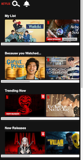

# Procesverslag
Markdown is een simpele manier om HTML te schrijven.  
Markdown cheat cheet: [Hulp bij het schrijven van Markdown](https://github.com/adam-p/markdown-here/wiki/Markdown-Cheatsheet).

Nb. De standaardstructuur en de spartaanse opmaak van de README.md zijn helemaal prima. Het gaat om de inhoud van je procesverslag. Besteedt de tijd voor pracht en praal aan je website.

Nb. Door *open* toe te voegen aan een *details* element kun je deze standaard open zetten. Fijn om dat steeds voor de relevante stuk(ken) te doen.

## Jij

  
uitwerken voor kick-off werkgroep

  ### Auteur:
  Isabelle Eldering.

  #### Je startniveau:
  Blauwe Piste

  #### Je focus:
  Surface plane (Bling Bling)
 

## Je website

  
uitwerken voor kick-off werkgroep

  ### Je opdracht:
  link naar de website die je gaat namaken óf de naam/omschrijving van je eigen ontwerp

  #### Screenshot(s) van de eerste pagina (small screen): 
  hier de naam van de pagina  
  

  #### Screenshot(s) van de tweede pagina (small screen):
  hier de naam van de pagina  
  
 

## Toegankelijkheidstest 1/2 (week 1)

  
uitwerken na test in 1e werkgroep

  ### Bevindingen
  Lijst met je bevindingen die in de test naar voren kwamen:

  #### Screenreader
  Hier korte omschrijving:
  Het was erg ingewikkeld om voor elkaar te krijgen. Ik snapte niet goed hoe het nou moest werken.

  Hier een omschrijving van hoe het opgelost kan worden (met indien nodig afbeeldingen)

  #### Muis en Toetsenbord 
  Hier korte omschrijving: 
    Keyboard only:
    Het was heel erg omslachtig om de hele tijd op TAB te blijven drukken totdat je uiteindelijk bij het linkje was waar je wilde zijn.
    Baloon hoog houden:
    Het is niet heel erg vervelend. het is lastig met een lange tekst lezen want dan moet je natuurlijk geconcentreed zijn of bij het indrukken van je trackpad op je mac. daar is het lastige

  Hier een omschrijving van hoe het opgelost kan worden:
  Voor Keyboard only zou je bijvoorbeeld snel menus kunnen maken zodat je het blijven tabben door alle linkjes in de menus skippen
  Voor concentratie problemen zou je kunnen denken aan niet al te lange teksten en duidelijke buttons.

  #### Motoriek (shocks, elastiekjes)
  Hier korte omschrijving:
  Elastiekjes:
    Dat is op je computer redelijk te doen. Je kan bijna alles gewoon doen. Bij je telefoon wordt het lastiger. Je gebruikt toch veel je telefoon met je duim. als je dan je duim niet hebt maakt dat het heel lastig en moet je eerder de telefoon neerleggen of in je andere hadn houden.

    Shocks:
    Het was erg lastig om de controle over je arm en hand te houden.

  Hier een omschrijving van hoe het opgelost kan worden:
  Grotere knoppen en meer ruimte tussen de knoppen.

  #### Visueel (brillen, contrast, kleurenblind, dark/light). 
  Hier korte omschrijving:
    - De bril met een zwarte stip:
    Is erg hinderlijk. Je kan eigenlijk niks meer zien. Ik als niet blinden kan dan nog cheaten door rond om die stip te kijken en dan kan je nog genoeg zien, maar voor iemand die het wel heeft kan je daar niet om heen en overal waar je heen kijkt kan zie je de stip.

  Hier een omschrijving van hoe het opgelost kan worden:
  Grote muis en grote letters

## Breakdownschets (week 1)

  
uitwerken na afloop 2e werkgroep

  ### de hele pagina: 
  

  ### dynamisch deel (bijv menu): 
  

  ### wellicht nog een dynamisch deel (bijv filter): 
  

## Voortgang 1 (week 2)

  
uitwerken voor 1e voortgang

  ### Stand van zaken
  Ik vond het heel lastig om op gang te komen. Ik wist niet goed hoe ik moest beginnen.

  Ik wilde het eerst op deze manier gaan vormgeven:
  
  
  
  
  
  
  En dat zag er dan zo uit zonder CSS:
  
  
  

  Maar ik kwam niet verder op deze manier, omdat ik niet goed wist hoe ik dat dan moest gaan vormgeven dat het er op dezelfde manier uit komt te zien als bij Netflix.

  Dus heb ik hulp gevraagd bij 1 van mijn klasgenoten.
  Hij zei dat ik het beste van die <a> een  kan maken en dan gewoon de afbeeldingen van Netflix zelf gebruiken.
  
  
  

  
  
  
  Ik denk dat ik al goed opweg ben.

  ### Agenda voor meeting
  samen met je groepje opstellen

  | Isabelle       | student 2          | student 3    | student 4        |
  | ---            | ---                | ---          | ---              |
  | Semantiek van mn code  | en dit             | en ik dit    | en dan ik dat    |
  | Vragen stellen | dit als er tijd is | nog een punt | dit wil ik zeker |
  | horizontale scrollbalken weg         | ...                | ...          | ...              |

  ### Verslag van meeting
  hier na afloop snel de uitkomsten van de meeting vastleggen

  - punt 1
  - punt 2
  - nog een punt
  - ...

## Voortgang 2 (week 3)

  
uitwerken voor 2e voortgang

  ### Stand van zaken
  hier dit ging goed & dit was lastig (neem ook screenshots op van delen van je website en code)

  ### Agenda voor meeting
  samen met je groepje opstellen

  | student 1      | student 2          | student 3    | student 4        |
  | ---            | ---                | ---          | ---              |
  | dit bespreken  | en dit             | en ik dit    | en dan ik dat    |
  | en dat ook nog | dit als er tijd is | nog een punt | dit wil ik zeker |
  | ...            | ...                | ...          | ...              |

  ### Verslag van meeting
  hier na afloop snel de uitkomsten van de meeting vastleggen

  - punt 1
  - punt 2
  - nog een punt
- ...

## Toegankelijkheidstest 2/2 (week 4)

  
uitwerken na test in 8e werkgroep

  ### Bevindingen
  Lijst met je bevindingen die in de test naar voren kwamen (geef ook aan wat er verbeterd is):

  #### Screenreader
  Hier korte omschrijving (met indien nodig afbeeldingen)

  Hier een omschrijving van hoe het opgelost kan worden (met indien nodig afbeeldingen)

  #### Muis en Toetsenbord 
  Hier korte omschrijving (met indien nodig afbeeldingen)

  Hier een omschrijving van hoe het opgelost kan worden (met indien nodig afbeeldingen)

  #### Motoriek (shocks, elastiekjes)
  Hier korte omschrijving (met indien nodig afbeeldingen)

  Hier een omschrijving van hoe het opgelost kan worden (met indien nodig afbeeldingen)

  #### Visueel (brillen, contrast, kleurenblind, dark/light). 
  Hier korte omschrijving (met indien nodig afbeeldingen)

  Hier een omschrijving van hoe het opgelost kan worden (met indien nodig afbeeldingen)

## Voortgang 3 (week 4)

  
uitwerken voor 3e voortgang

  ### Stand van zaken
  hier dit ging goed & dit was lastig (neem ook screenshots op van delen van je website en code)

  ### Agenda voor meeting
  samen met je groepje opstellen

  | student 1      | student 2          | student 3    | student 4        |
  | ---            | ---                | ---          | ---              |
  | dit bespreken  | en dit             | en ik dit    | en dan ik dat    |
  | en dat ook nog | dit als er tijd is | nog een punt | dit wil ik zeker |
  | ...            | ...                | ...          | ...              |

  ### Verslag van meeting
  hier na afloop snel de uitkomsten van de meeting vastleggen

  - punt 1
  - punt 2
  - nog een punt
  - ...

## Eindgesprek (week 5)

  
uitwerken voor eindgesprek

  ### Je uitkomst - karakteristiek screenshots:
  

  ### Dit ging goed/Heb ik geleerd: 
  Korte omschrijving met plaatjes

  

  ### Dit was lastig/Is niet gelukt:
  Korte omschrijving met plaatjes

  

## Bronnenlijst

  
continu bijhouden terwijl je werkt

  Nb. Wees specifiek ('css-tricks' als bron is bijv. niet specifiek genoeg).

  1. bron 1
  2. bron 2
  3. ...

